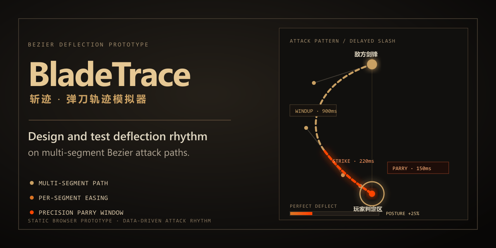

# BladeTrace

[English](README.md)

BladeTrace 是一个可直接在浏览器运行的练习场与设计工具：动作游戏开发者可观察和调节多段三阶贝塞尔攻击的节奏；不苛求高规格画面、但喜欢弹反节奏的玩家也能直接反复练习。



## 功能

- 让敌方剑锋光标沿可配置的多段三阶贝塞尔路径移动，并支持分段缓动与时长。
- 在最后打击前开启精确弹反窗口，提供简单、标准、困难和“招式内置”四种时机设置。
- 结算完美弹反、玩家受击、敌方架势与忍殺流程；完美弹反只累积敌方架势，不扣敌方 HP。
- 提供 6 个普通攻击预设，包括延迟斩、连斩、跳劈、螺旋突进轨迹与迟滞慢刀。
- 对全部内置招式校验分段连续性、时长、缓动、弹反窗与受击区范围，以及终点命中或落空关系。
- 每个预设都提供简短练习说明：玩家可按节奏选择招式，开发者则可查看同一份底层数据。
- 可选显示控制点、分段标签、剑锋尾迹、合成 Web Audio 反馈和敌人自动连续发招。
- 提供仅本地生效的当前招式画布编辑模式：可选中曲线段，并直接在运行时视图拖拽 P0–P3 控制点、红色 `R` 受击区手柄和橙色 `W` 弹反窗手柄。拆分、删除放在紧凑工具条中；名称、精确数值、时长与缓动保留在按需展开的高级参数里。画布会高亮该仅按时间轴计算的判定窗覆盖的最终轨迹范围；相邻段端点会保持连续，刷新页面即丢弃修改。

## 运行

不需要构建步骤或 Web 服务器。直接在当前浏览器中打开 [app/index.html](app/index.html) 即可。

本次工作已在本地 Microsoft Edge 中完成融合原型的冒烟测试；其他浏览器尚未在这里验证。

## 操作方式

| 输入 | 结果 |
| --- | --- |
| 待机时按 `Space` | 发起当前选中的攻击 |
| 攻击中按 `Space` | 尝试弹反 |
| 待机时按 `Enter` | 发起当前选中的攻击 |
| 攻击中点击画布 | 尝试弹反 |
| 架势崩溃后按 `Space` 或点击忍殺按钮 | 执行忍殺 |
| 点击“进入画布编辑” | 直接在当前招式的运行时轨迹上编辑 |

连续完成 4 次完美弹反即可打满敌方架势，然后执行忍殺。完美弹反只增加敌方架势；玩家受击会扣除 HP 并清空敌方架势。控制区可切换招式、判定窗、轨迹辅助显示、自动循环和音效。画布编辑模式会暂停战斗：点击曲线选段，拖带标签的控制点改路径，拖红色 `R` 调整固定在玩家位置的受击区，或沿轨迹拖橙色 `W` 调整招式内置弹反窗。拖动 `W` 会自动让当前练习使用“招式内置判定窗”。仅当招式终点落入受击区时才结算受击；它与仅按时间轴计算的弹反判定窗彼此独立。

## 开发

在仓库根目录执行以下已验证命令：

```powershell
node --check app/pattern-validation.js
node --check app/attack-patterns.js
node --check app/game.js
node --test tools/pattern-validation.test.cjs
node tools/verify-app.mjs
```

测试命令会通过公开的招式校验 seam 验证有效与故意无效的配置。最后一条命令会检查独立入口、必需控件、已验证的内置招式、无障碍标记，以及是否依赖远程运行时资源。本次融合还执行了真实浏览器冒烟测试，但仓库暂未提交浏览器测试脚手架。

## 仓库结构

```text
app/       当前可运行的融合原型
docs/      融合审计、拟议架构、路线图和社交预览素材
tools/     确定性的静态验证
```

请阅读[融合审计](docs/fusion-audit.md)了解逐项合并结果；[拟议架构](docs/architecture.md)说明验收后才进行的模块化计划；[路线图](docs/roadmap.md)说明后续阶段。

## 当前状态与限制

普通攻击的核心练习循环和内存内的本地招式编辑器已经实现，但仍是轻量原型。编辑器不会保存、导入、导出或写回源码；页面刷新后会恢复初始预设。当前阶段新增纯规则 seam `app/pattern-validation.js` 和纯数据招式库 `app/attack-patterns.js`，浏览器整合仍位于 `app/game.js`；更大的拟议架构尚未实施。

玩家架势、格挡、看破突刺、跳跃应对横扫、可持久化/可分享的招式配置，以及本地 Edge 冒烟覆盖以外的跨浏览器兼容性测试尚未实现。敌方 HP 有意不纳入当前普通攻击循环：玩家的目标是打满敌方架势并执行忍殺。原始 demo 源码与设计文档已在融合版通过验收后移除；融合审计保留在 `docs/`，Git 历史可追溯原始材料。

## 许可证

仓库当前未包含开源许可证。
