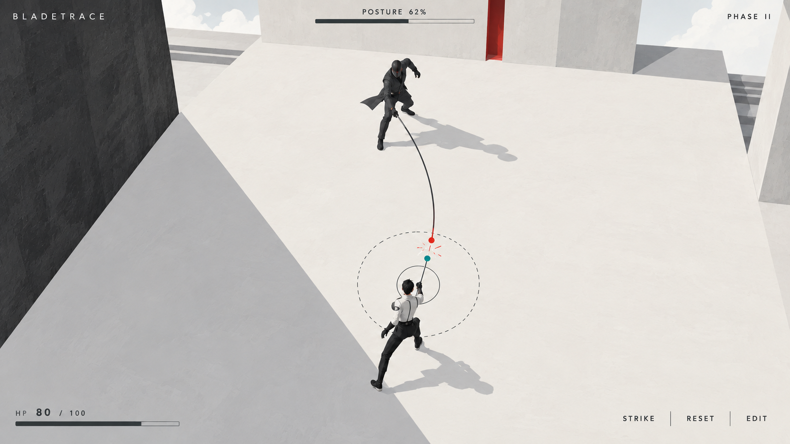

# 已选美术方向：白垩剧场

2026-10-03 用户确认。本图是后续美术制作的基线，不是当前游戏运行截图。

- 保留白垩哑光、黑白大色面、少量红色、建筑尺度感与战斗留白。
- 以 2D 制作方向推进；有透视空间感不等于改用 3D 引擎。
- 题材已确定为浮空塔上的学院派奥术决斗，图中刀剑与角色动作仍为占位，后续需要重新设计。
- 判定圈、轨迹与作用点以游戏运行规则为准，不直接采用生成图作为几何规范。

详见 [创作基线](../../creative-foundation.md)。

## 生成记录

使用内置 imagegen，以本地「白室决斗」概念图为编辑输入生成；[定稿提示词](selected-prompt.json)随图保存。母稿和其他候选、对比页面仍保留在原工作站，仅本地排除，不是远端必需依赖。提示词描述生成时的刀剑占位内容，不代表后来确定的奥术题材。
